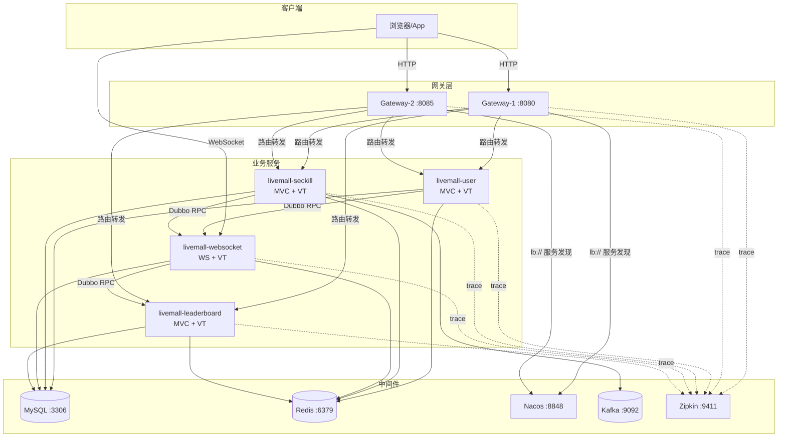
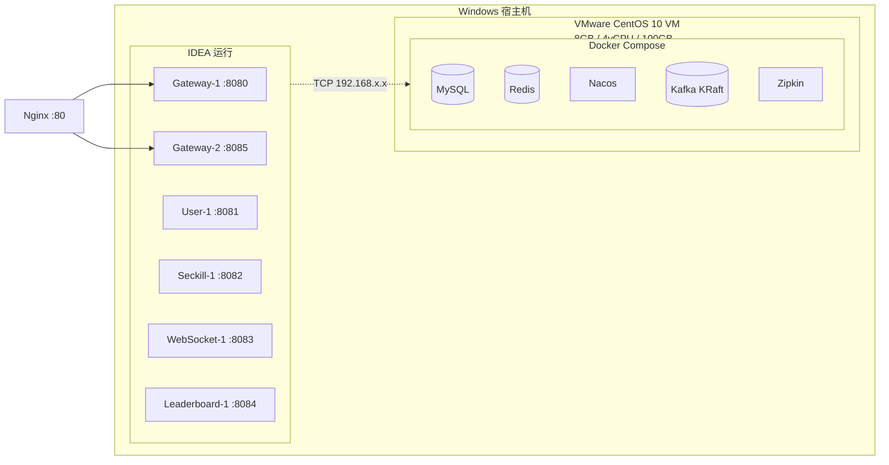
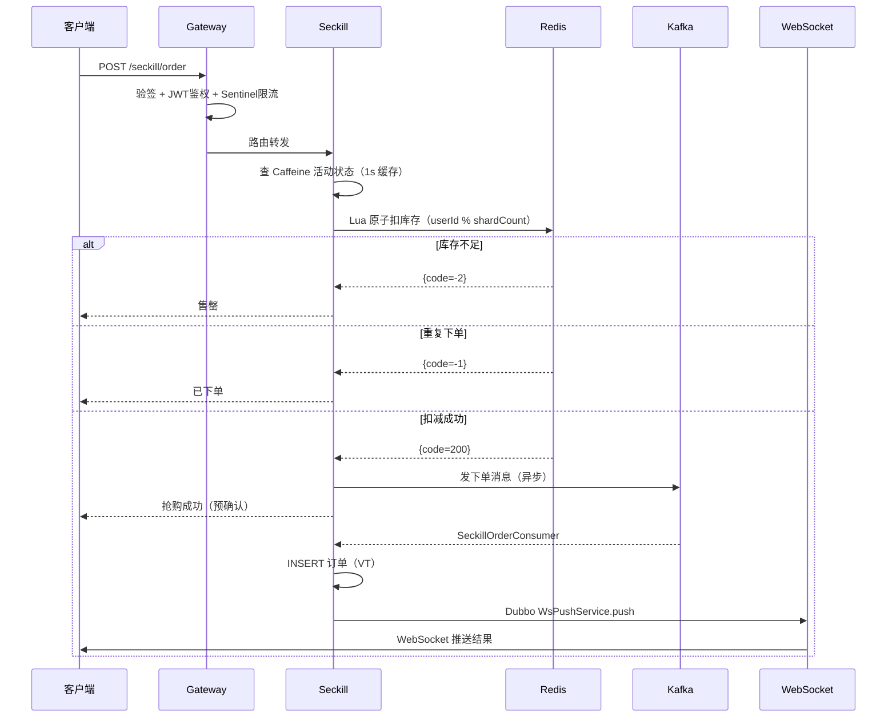

# 项目概览

## 项目定位

高并发直播电商秒杀系统，面向秋招展示技术深度。模拟直播间场景下的秒杀抢购、实时排行榜、弹幕互动等功能，目标是 10w QPS 的架构设计深度而非业务广度。

## 设计原则

- **宁深勿广**：5 个服务，每个有独立技术纵深，不要 30 个浅尝辄止的场景
- **面试导向**：每个技术选型都有对比、有理由、有 trade-off，面试官无论怎么追问都能接住
- **AI 优先**：设计足够详细（类、方法、流程、兜底），直接可用 AI 代码生成
- **落地优先**：不做纯概念设计，每个点都有对应的代码实现方案

## 项目结构

```
livemall
├── livemall-common              # 公共模块
│   ├── src/main/java/...
│   │   ├── dto/                 # 通用 DTO
│   │   ├── api/                 # Dubbo API 接口
│   │   ├── util/                # 工具类
│   │   ├── constant/            # 常量
│   │   └── exception/           # 异常体系
│   └── pom.xml
│
├── livemall-gateway              # 网关服务 (WebFlux)
│   ├── src/main/java/...
│   │   ├── filter/
│   │   │   ├── JwtAuthGlobalFilter.java
│   │   │   └── SignVerifyGlobalFilter.java
│   │   ├── config/
│   │   │   └── SentinelConfig.java
│   │   └── model/
│   │       └── TokenPair.java
│   └── pom.xml
│
├── livemall-user                 # 用户服务
│   ├── src/main/java/...
│   │   ├── controller/
│   │   ├── service/
│   │   ├── repository/
│   │   ├── entity/
│   │   └── interceptor/
│   └── pom.xml
│
├── livemall-seckill              # 秒杀服务
│   ├── src/main/java/...
│   │   ├── controller/
│   │   ├── service/
│   │   ├── consumer/
│   │   ├── scheduler/
│   │   ├── entity/
│   │   └── repository/
│   └── pom.xml
│
├── livemall-websocket            # 长连接服务
│   ├── src/main/java/...
│   │   ├── websocket/
│   │   ├── service/
│   │   └── dto/
│   └── pom.xml
│
├── livemall-leaderboard          # 排行榜服务
│   ├── src/main/java/...
│   │   ├── controller/
│   │   ├── service/
│   │   ├── scheduler/
│   │   └── entity/
│   └── pom.xml
│
├── docker-compose.yml
├── sql/
│   └── init.sql
├── pom.xml                       # 父 POM
└── README.md
```

## 模块职责

| 模块 | 负责功能 | 端口 | 技术栈 |
|------|---------|------|--------|
| common | 工具类、Dubbo API 接口定义 | - | Java 21 |
| gateway | 路由转发、JWT 鉴权、签名验签、Sentinel 限流 | 8080 | WebFlux + Sentinel |
| user | 注册登录、双 Token 签发与刷新、设备管理 | 8081 | Spring MVC + VT |
| seckill | 秒杀活动、Redis Lua 库存扣减、Kafka 异步下单、订单超时、多级缓存 | 8082 | Spring MVC + VT |
| websocket | 直播连接管理、消息推送、心跳检测、弹幕广播、跨节点路由 | 8083 | Spring WS + VT |
| leaderboard | ZSet 实时排行、事件加分、定时快照 | 8084 | Spring MVC + VT |

## 系统架构图

### 服务调用拓扑



### 部署拓扑图



### 秒杀全链路数据流



## 技术栈总览

| 分类 | 选型 | 不选什么 |
|------|------|---------|
| 语言 | Java 21（VT + ScopedValue） | Java 17/8 |
| 框架 | Spring Boot 3.x + Spring Cloud | - |
| RPC | Dubbo | Feign / gRPC |
| 网关 | Spring Cloud Gateway (WebFlux) | Zuul |
| 缓存 | Caffeine (L1) + Redis (L2) | Guava / Ehcache |
| MQ | Kafka | RocketMQ / RabbitMQ |
| 限流 | Sentinel（嵌入模式） | Hystrix / Resilience4j |
| 追踪 | Micrometer Tracing + Zipkin | Skywalking |
| 注册中心 | Nacos（注册中心 + 配置中心） | Zookeeper / Consul |
| 分布式 ID | Snowflake | UUID / Leaf |
| 数据库 | MySQL 8.x | - |
| API 文档 | Knife4j | Swagger UI |
| 容器化 | Docker Compose | K8s |

## 中间件端口

| 组件 | 端口 |
|------|------|
| MySQL | 3306 |
| Redis | 6379 |
| Nacos | 8848 / 9848（注册中心 + 配置中心） |
| Kafka | 9092 |
| Zipkin | 9411（压测/演示时关闭，降低资源占用） |

## 关联文档

- [全功能清单](1.3-全功能清单.md)
- [技术选型分析](1.2-技术选型分析.md)
- [项目约束清单](1.4-项目约束清单.md)
- [性能目标与SLO](1.5-性能目标与SLO.md)
- [安全设计总览](1.6-安全设计总览.md)
- [各模块详细设计](../2-模块详细设计/)
  - 各模块实现的端口与本表对应，如网关详见 `2.6-网关与可观测性.md` §路由转发
