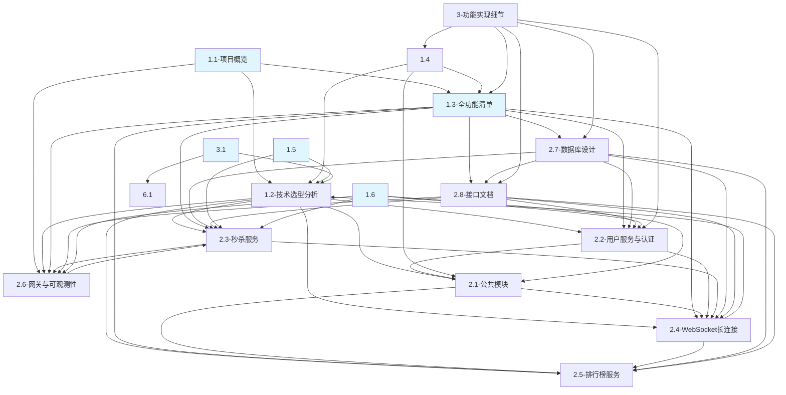

# 文档地图

> 职责边界 + 引用关系，避免内容重复和职责模糊。
> ⚠️ 新增跨文档引用时，必须同步更新本文档的依赖图和反查表。引用精确到文件名 + 小节。

---

## 一、文档注册表

| 编号 | 文件 | 职责 | 不写什么 |
|------|------|------|---------|
| 1.1 | 项目概览 | 定位、设计原则、模块职责、技术栈摘要、端口 | 功能细节（在 1.3）、选型分析（在 1.2） |
| 1.2 | 技术选型分析 | 选型对比表格、核心理由、面试追问方向 | 代码实现（在 2.x） |
| 1.3 | 全功能清单 | 40 个功能列表、模块归属、前置依赖 | 实现细节、架构分析 |
| 1.4 | 项目约束清单 | VT 纪律、中间件约束、错误码摘要（源见2.1）、文档约束、审查流程 | 技术选型分析（在 1.2）|
| 1.5 | 性能目标与SLO | QPS/Latency 拆解、组件容量上限、瓶颈分析、压测计划 | 选型分析（在 1.2）、部署细节（在 5.1）|
| 1.6 | 安全设计总览 | STRIDE 威胁模型、认证/加密/业务安全分层、面试应答框架 | 各模块实现细节（在 2.x/3.x）|
| 3.1 | 技术决策清单 | 17 项技术决策的状态、理由、trade-off、面试追问 | 选型深度对比（在 1.2）、实现代码（在 2.x）|
| 2.1 | 公共模块 | Snowflake / DFA / 签名 / ScopedValue / Dubbo API / 错误码主表（单向源） | 选型对比（在 1.2） |
| 2.2 | 用户服务与认证 | 登录注册、双 Token 刷新、设备管理、表 DDL、安全策略 | 选型对比（在 1.2） |
| 2.3 | 秒杀服务 | Redis Lua、库存分片、订单状态机、Sentinel 配置、表 DDL、降级方案 | 选型对比（在 1.2）、Sentinel 原理（在 2.6） |
| 2.4 | WebSocket 长连接 | 技术模型、会话路由、心跳、踢人、消息协议、降级方案 | 选型对比（在 1.2） |
| 2.5 | 排行榜服务 | ZSet 操作、跳表原理、定时快照、热 Key 分析 | 选型对比（在 1.2） |
| 2.6 | 网关与可观测性 | Gateway 路由、JWT 鉴权、签名验签、Sentinel 配置、Zipkin 配置、ScopedValue 传递策略 | 选型对比（在 1.2） |
| 2.7 | 数据库设计 | 所有 DDL、索引策略、存储估算 | 缓存/异步方案（在其他模块） |
| 2.8 | 接口文档 | 全量 REST + WS 接口定义、统一返回格式、鉴权方式 | 实现细节、选型理由 |
| 3 | 功能实现细节 | 单功能级实现设计（流程/I-O/关键代码/边界/安全） | 模块整体架构（在 2.x） |

> 编号 4（面试准备）、5（运维部署）待后续建设。

---

## 二、文档依赖图

**箭头含义**：A → B 表示 A 中链接引用了 B。
**图例**：蓝色 = 架构概览 | 白色 = 模块设计

---

## 三、反查表

修改某文档前，先看有哪些文档引用了它，确保引用链接不失效。

| 文档 | 被谁引用 |
|------|---------|
| 1.1-项目概览 | 2.6-网关与可观测性 |
| 1.2-技术选型分析 | 1.1-项目概览、2.4-WebSocket、3.1-技术决策清单、1.5-性能目标 |
| 1.3-全功能清单 | 1.1-项目概览 |
| 1.4-项目约束清单 | 1.2-技术选型分析、2.1-公共模块、1.3-全功能清单、3-功能实现细节 |
| 1.5-性能目标与SLO | 1.1-项目概览 |
| 1.6-安全设计总览 | 1.1-项目概览 |
| 3.1-技术决策清单 | 1.2-技术选型分析 |
| 2.1-公共模块 | 1.2-技术选型分析、2.2-用户服务、2.4-WebSocket、2.5-排行榜、2.6-网关、1.4-约束清单、1.6-安全设计 |
| 2.2-用户服务与认证 | 1.2-技术选型分析、1.3-全功能清单、2.1-公共模块、2.7-数据库设计、2.8-接口文档、1.6-安全设计 |
| 2.3-秒杀服务 | 1.2-技术选型分析、1.3-全功能清单、2.6-网关、2.7-数据库设计、2.8-接口文档、1.5-性能目标、1.6-安全设计 |
| 2.4-WebSocket 长连接 | 1.2-技术选型分析、1.3-全功能清单、2.1-公共模块、2.2-用户服务、2.3-秒杀服务、2.5-排行榜、2.7-数据库设计、2.8-接口文档 |
| 2.5-排行榜服务 | 1.2-技术选型分析、1.3-全功能清单、2.1-公共模块、2.4-WebSocket、2.7-数据库设计、2.8-接口文档 |
| 2.6-网关与可观测性 | 1.1-项目概览、1.2-技术选型分析、1.3-全功能清单、2.3-秒杀服务、2.8-接口文档 |
| 2.7-数据库设计 | 1.3-全功能清单、2.4-WebSocket、2.5-排行榜 |
| 2.8-接口文档 | 1.3-全功能清单、2.4-WebSocket、2.7-数据库设计、3-功能实现细节 |
| 1.4-项目约束清单 | 1.2-技术选型分析、2.1-公共模块、1.3-全功能清单、3-功能实现细节 |
| 3-功能实现细节 | 1.4-项目约束清单 |
